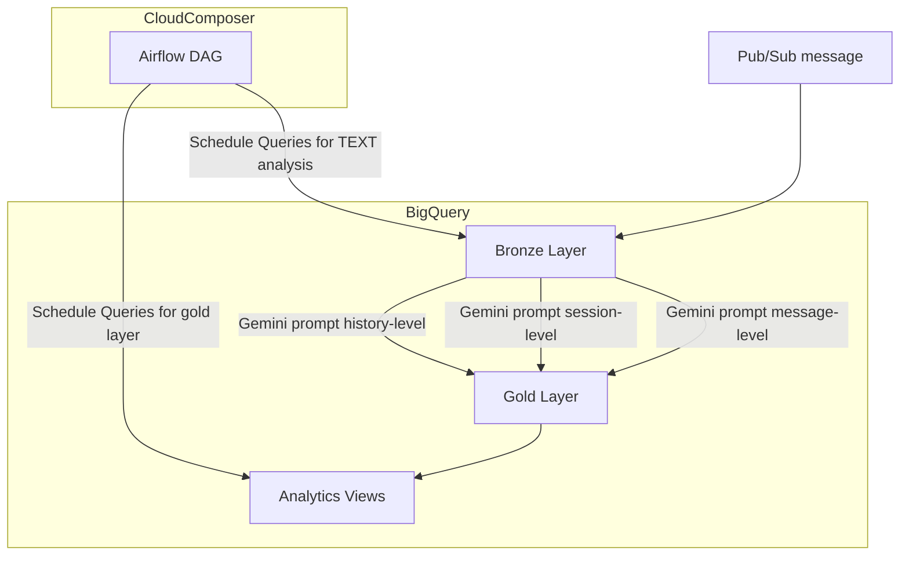

# 🚀 Part 1: Case Study Intro

## The Scenario

Lore has launched a new product that uses RAG to find participating therapists that have good reviews (based on chat analysis as well as external sources) in the customer's particular struggles or issue. The product then keeps an ongoing chat with the customer to keep tabs on their progress in real human therapy. Lore then maintains a profile on therapists and continually evaluates recommendations based on their performance.

The product is in beta, launching to the public soon, and we want to be able to understand in real time how it's going. It's critical for financial reasons that we be able to provide accurate performance feedback to participating vendors, because our continued success with our partners depends on the success within the app (and ultimately within the lives) of the customers they refer to us.

## Philosophy Overview

My foremost goal is not to just:

- Deliver pipelines
- Design tables
- Ingest raw data from various complex sources into one unified blob storage lake

My objective is to **rapidly enable analytics** that are robust and provide a full business performance report, and ultimately **provide a competitive edge** to business decision makers *at all levels*.

In other words:

| Little to no intrinsic business value | Reason |
|----------|-------|
| Designed over 100 dim_* tables in a warehouse | Models for models' sake are pointless|
| Successfully automated over a dozen workflows (that each took 15 minutes to do manually every month)  | Not necessarily impactful to business initiatives|
| Migrated from old warehouse (that no one used) to new, cleaner warehouse (that also no one uses) | Upkeep masquerading as growth|

| A lot of value | Reason |
|----------|-----|
| Reducing analysis time of new questions by 90% | Provides a competitive edge in industry
| Enabling data-driven decision making about chat model, based on conversation sentiments | Tried and true principles for modern products|
| Multiple squads compute the same metric -> everyone gets the same answer| Valid source of truth |
| Over 90% of employees hitting the same dashboard daily, and few ad hoc queries issued against gold tables| Everybody on the same page|

## Source Data

Full product chat history in `data/chats.json`

### Productionalization
In production suppose this chat history is ingested in real time into the data warehouse side via Pub/Sub.

I'll discuss further down in detail how I would productionalize a real system, but for the demo I'll just use
a raw file that we can pretend lives in GCS.

## Objectives

1. Define usable performance metrics that can be created from the product chat data, and model a schema for said metrics.
2. Deploy a robust pipeline that ingests the incoming data for this product and transform it into said metrics.
    - If data that isn't found in `data/chats.json` (e.g. customer_signup_date) is needed for the metrics, I'm going to
    pretend they already exist elsewhere in the data warehouse, and use/combine them freely

## Deliverables as per case study instructions

1. A working PoC with instructions how to use
2. An extension of this README containing:
    - An architecture diagram as well as metric and schema dictionary
    - A list of key considerations for this data product
3. A discussion of the technologies I'd use in a real production system, and how I'd improve a real PoC given more time

---

---

# 🚀 Part 2: Deliverables 

## PoC Guide

### Installation

- Create a venv using the python version stated in `.python-version`
- `python3 -m venv .venv`
- `source .venv/bin/activate`
- `pip install -r requirements.txt`

### Running the program

- `python3 main.py`

### Examining the output

- Use DBeaver or your favorite SQL GUI or CLI to check out the tables in `output/warehouse.db`

## Architecture

### Schema and metrics

Incomplete list of the metrics I would make computable in the analytics-facing warehouse layer, or compute and persist in analytics views myself.

| Metric | Definition |
|---|---|
| **daily_new_sign_ups** | new product activations |
| **daily_new_activated_users** | users who went all the way through to therapist appointment intake for the first time|
| **DAU** | 
| **MAU** | 
| **referred_customer** | flag for organic growth vs. paid growth / partner referral|
| **avg_conversation_length** | number of message & response pairs |
| **avg_conversation_length_temporal** | time duration of full conversation |
| **avg_messages_per_day** | |
| **avg_messages_per_chat** | |
| **total_messages_by_customer** | |
| **num_therapist_referrals** | |
| **avg_minutes_in_chat_per_day** | elapsed time while actively conversing |
| **overall_chat_sentiment_score** | whether a customer has found a chat helpful overall|
| **landed_in_product** | whether customer has used other Lore app products first |
| **well_rounded** | whether customer has explored other features |
| **7_day_retention_rate** | proportion of customers still active after elapsed time|
| **30_day_retention_rate** | proportion of customers still active after elapsed time|
| **90_day_retention_rate** | proportion of customers still active after elapsed time|
| **365_day_retention_rate** | proportion of customers still active after elapsed time|
| **mood_trend** | transition of customer's general mood over duration of using product|
| **goal_completion_rate** | rate of customers who have found resolution in their initial need for therapy|
| **num_improvements** | count of times a customer stated something like "I feel better about my issue than I did a month ago"|
| **improvement_rate** | rate of customers who have reported some improvement after using product to some predefined extent|
| **avg_time_to_improvement** |for customers who reported improvement in app, how long did it take |
| **avg_response_latency_user** | |
| **avg_response_latency_assistant** | |
| **avg_response_quality_user** | rate of responses in a chat session that were meaningful and on topic |
| **num_meaningful_chats** | count of chats that were productive |
| **meaningful_chat_rate** | rate of chats that were productive |
| **conversation_abandon_rate** | |
| **conversation_completion_rate** | |
| **conversation_regeneration_rate** | |
| **safety_intervention_rate** | |
| **hallucination_rate** | |
| **harmful_response_reports** | |
| **safety_intervention_false_positives** | |
| **cost_per_chat** | |
| **cost_per_active_user** | |

### Key considerations

## Productionalization and PoC Improvements
